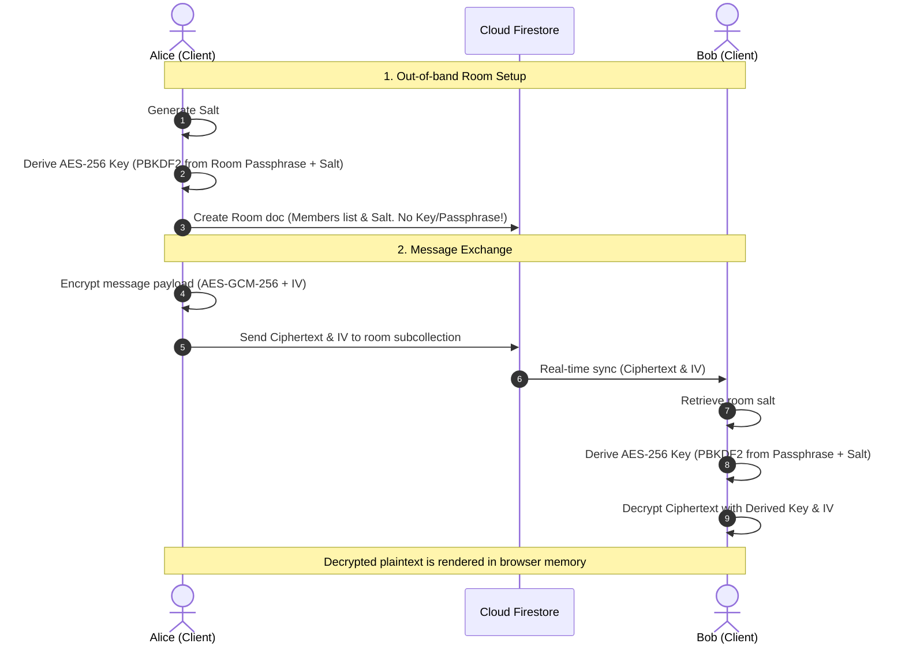

# SecureSphere: Zero-Knowledge E2EE Messaging App

SecureSphere is a modern, state-of-the-art web application for zero-knowledge, End-to-End Encrypted (E2EE) messaging. It supports group chats, direct messages, secure file sharing, and self-destructing/temporary messages. Built with **React**, **Vite**, **TypeScript**, **TailwindCSS v4**, and **Firebase Firestore**, SecureSphere implements a robust, client-side cryptographic system that keeps your conversations completely private.

---

## 🔒 Cryptographic Design

SecureSphere implements a **Zero-Knowledge** architecture: **no unencrypted text or files are ever sent to the database or stored on the cloud.**



### 1. Key Derivation (PBKDF2)
- When a room is created, the client generates a cryptographically secure random 16-byte salt (`generateSaltHex` using `crypto.getRandomValues`).
- When unlocking or entering a room, the client derives a 256-bit AES-GCM key from the human-entered room passphrase and the room's unique salt.
- The derivation utilizes **PBKDF2** with **SHA-256** and **100,000 iterations**, ensuring resilience against brute-force attacks.
- Derived keys are stored strictly in the browser's active execution memory (React state) and are **never** written to disk or sent over the network.

### 2. Encryption/Decryption (AES-GCM-256)
- Message payloads (text and files) are encrypted on the sender's client using **AES-GCM-256** with a unique, random 12-byte Initialization Vector (IV).
- The resulting Base64-encoded ciphertext and IV are written to the subcollection in Firestore.
- Because the passphrase is never stored on the server, third parties (including Firebase operators) cannot decrypt your messages.

### 3. File Sharing (E2EE)
- SecureSphere supports sharing files up to **500KB** directly within chats.
- Files are converted to Data URLs, E2EE encrypted client-side using the room's AES-GCM key, and stored securely as encrypted string payloads in Firestore.
- Receivers download and decrypt the file base64 data directly inside their browser context.

### 4. Self-Destruct / Expiring Messages
- Users can choose to set custom expiration times for their messages (e.g., 5 seconds, 1 minute, 1 hour).
- Expiring messages contain an `expiresAt` timestamp.
- The client app runs a background interval that monitors and auto-triggers hard deletions of expired messages directly from Firestore, ensuring data is wiped at both client and server levels.

---

## ✨ Features

- **End-to-End Encryption**: Secure 1-on-1 and Group chats using the Web Crypto API.
- **Passphrase Locked Rooms**: Unlock chats using shared room passwords. Local Storage caches passphrases so rooms remain unlocked across browser refreshes, but logging out wipes the keys.
- **Self-Destructing Messages**: Choose an expiration countdown to automatically delete messages from the database.
- **E2EE File Attachments**: Share images, documents, and other files securely (up to 500KB) with direct E2E decryption.
- **Premium Glassmorphic Design**: Sleek dark dashboard styling, smooth micro-animations (Framer Motion), mesh-gradient background, custom scrollbars, and high-fidelity typography.
- **No Password Authentication**: Fast identity onboarding using a unique combination of display name and a random 4-digit code (e.g., `Alice#4920`).

---

## 🛠️ Requirements & Setup

### Prerequisites
- **Node.js** (v18.0.0 or higher)
- **NPM** or **Yarn**

### Installation
1. Clone the repository:
   ```bash
   git clone https://github.com/your-username/secure-messaging-app.git
   cd secure-messaging-app
   ```

2. Install dependencies:
   ```bash
   npm install
   ```

3. Create your local environment file:
   Copy the template `.env.example` file and save it as `.env.local`:
   ```bash
   cp .env.example .env.local
   ```
   Open `.env.local` and configure your Firebase keys (refer to the instructions below).

4. Run the development server:
   ```bash
   npm run dev
   ```
   Open your browser and navigate to `http://localhost:3000`.

5. Build for production:
   ```bash
   npm run build
   ```

---

## 🔥 Firebase Setup & Configuration

To make this application work with your own database instance, follow these steps:

### 1. Create a Firebase Project
1. Go to the [Firebase Console](https://console.firebase.google.com/).
2. Click **Add Project** and follow the prompts to create a new project.
3. Once the project is ready, click the **Web icon (`</>`)** on the Project Overview page to register a Web App.
4. Copy the `firebaseConfig` object credentials.

### 2. Configure Environment Variables
Open your `.env.local` file and paste the credentials matching the fields:
```env
VITE_FIREBASE_PROJECT_ID="your-firebase-project-id"
VITE_FIREBASE_APP_ID="1:327674895758:web:..."
VITE_FIREBASE_API_KEY="AIzaSy..."
VITE_FIREBASE_AUTH_DOMAIN="your-firebase-project-id.firebaseapp.com"
VITE_FIREBASE_FIRESTORE_DATABASE_ID="default"
VITE_FIREBASE_STORAGE_BUCKET="your-firebase-project-id.firebasestorage.app"
VITE_FIREBASE_MESSAGING_SENDER_ID="327674895758"
VITE_FIREBASE_MEASUREMENT_ID=""
```

### 3. Provision Cloud Firestore
1. In the Firebase Console left menu, navigate to **Build** -> **Firestore Database**.
2. Click **Create Database**.
3. Select your location and start the database in **Test Mode** (you will upload the secure rules in the next step).

### 4. Deploy Security Rules
To secure your database from unauthorized reads and writes, copy the contents of the `firestore.rules` file in this repository and paste it into the **Rules** tab of your Firestore Database console:

```javascript
// Copy contents of firestore.rules
```
Alternatively, deploy them via the Firebase CLI:
```bash
firebase deploy --only firestore:rules
```

### 5. Configure Firestore Indexes
This application performs custom filtering on chat rooms, which requires composite indexes. You can deploy the index configuration directly using the Firebase CLI with the provided `firestore.indexes.json`:

```bash
firebase deploy --only firestore:indexes
```
If you are not using the Firebase CLI, Firestore will automatically generate a clickable index creation link in your browser console log when a query fails due to a missing index. Simply click that link to automatically configure it.

> [!WARNING]
> Since this app uses a custom identity model (`displayName` + `tag`) cached in browser local storage and does not use Firebase Authentication, the security rules are open to public writes with strict schema validations. For production deployments, we highly recommend integrating **Firebase Authentication** (e.g. Anonymous or Email-based) and updating the rules to use `request.auth`.

---

## 📂 Project Structure

```
├── .env.example              # Env variables template
├── firestore.rules           # Security rules for Firestore
├── firestore.indexes.json    # Composite indexing definitions
├── index.html                # Web app entry markup
├── tailwind.config.ts        # Tailwind styling options
├── vite.config.ts            # Vite bundler options
├── src
│   ├── main.tsx              # React mounting root
│   ├── App.tsx               # Application shell, router & key storage
│   ├── types.ts              # TypeScript models (UserProfile, Message, Room)
│   ├── index.css             # Design system token configuration & core animations
│   ├── components
│   │   ├── Onboarding.tsx    # DisplayName selection, tag generation & signup
│   │   ├── ChatSidebar.tsx   # Left sidebar, rooms overview, and lock management
│   │   ├── ChatRoom.tsx      # Main message stream, attachments, E2EE key check & timer
│   │   └── NewChatModal.tsx  # Group creation, DM finder & E2EE salt generation
│   └── lib
│       ├── crypto.ts         # PBKDF2 key derivation and AES-GCM encrypt/decrypt helpers
│       └── firebase.ts       # Firestore config and initialization loader
```

---

## 📄 License
This project is licensed under the MIT License. Feel free to clone, modify, and distribute it.
